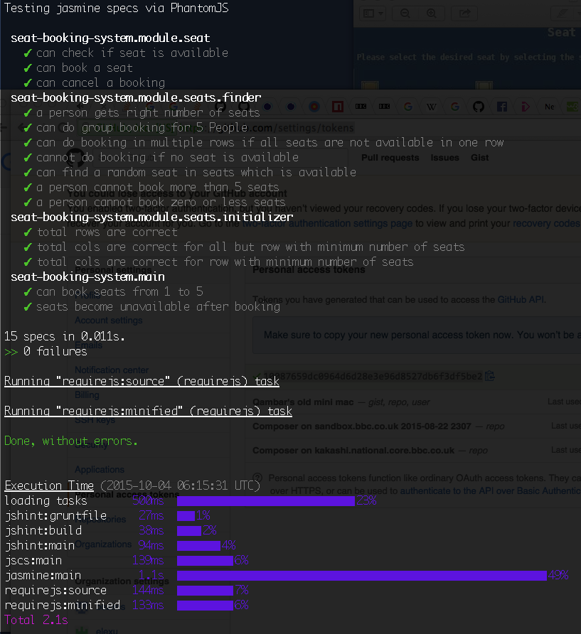
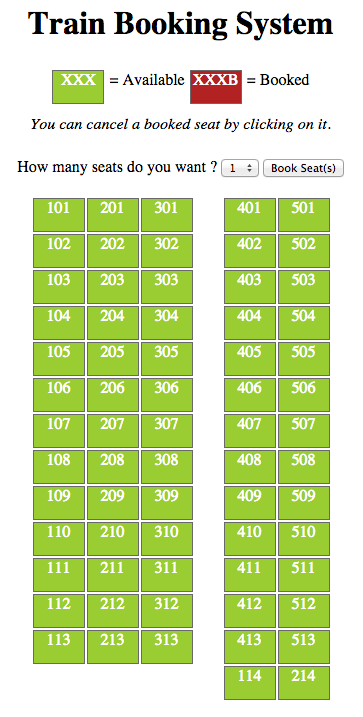

# Seat Booking System
This is a reusable component that can be used with any type of seat booking system.
It is intended to be an npm package which can be installed via `npm install`.

I am including an example of a train booking system in the examples folder.

# Development:

To contribute in the development or to view the source code, please
checkout this repository by running the following commands in order.

```
    git clone https://github.com/Qambar/seat-booking-system.git
    npm install
    grunt
```
You will see something like this in your console:




It will automatically start the webserver on your local so now you can visit:

```
http://localhost.bbc.co.uk:9091/
```
or if you want a live demo, open the following link in your browser:

```
http://qambar.github.io/seat-booking-system/
```

To view the demo for a "Train Seat Booking System".



