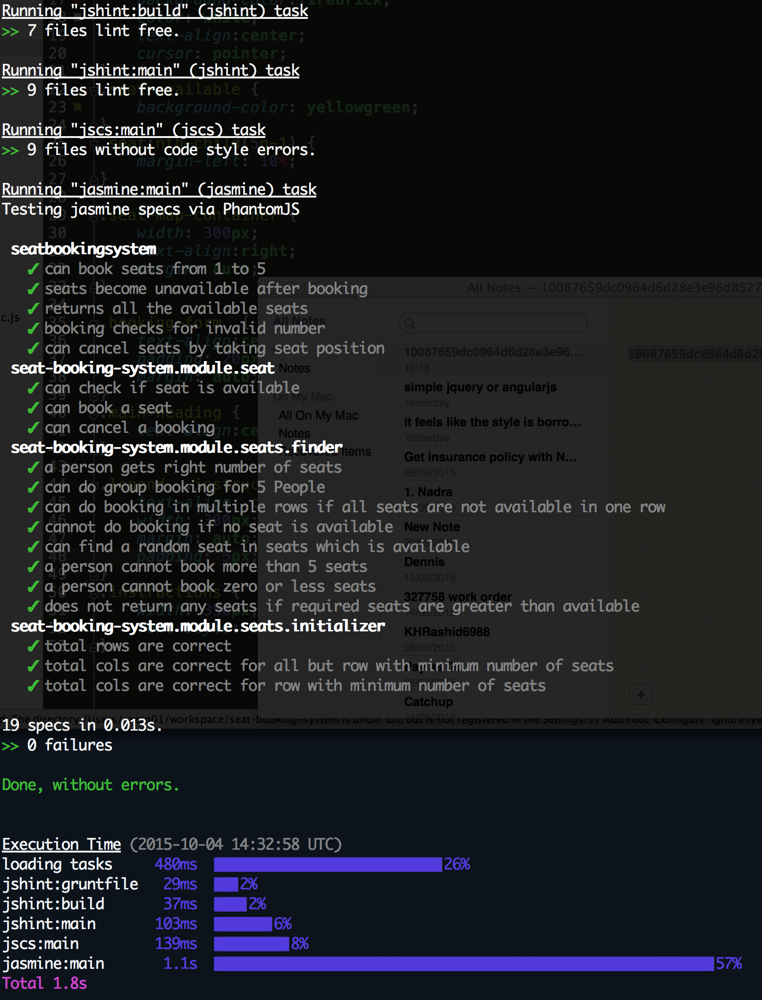

# Seat Booking System
This is a reusable component that can be used with any type of seat booking system.
It is intended to be a npm package which can be installed via `npm install`.

I am including an example of a train booking system in the examples folder.

# Development:

To contribute in the development or to view the source code, please
checkout this repository by running the following commands in order.

```
    git clone https://github.com/Qambar/seat-booking-system.git
    npm install
    grunt
```
You will see something like this in your console:





# Build a train booking system

In a train carriage there are 67 seats 13 rows of 5 (3 by 2) the last row has 2 seats.

A person can book between 1 and 5 seats.

A group booking should be such that the people of the group get to sit in the same row if possible.

Each booking is provided with their seat numbers after they enter the number of seats they require.

Build an application to manage the input of bookings and display the layout of the carriage as it fills up.


## We like code that has

- Unit tests
- Consistent style
- Objects with single responsibility
- Small readable methods

## Implementation

- You may choose to build a full JavaScript app and/or use server side components (PHP or Ruby).
- Please provide instructions to run the appliction
- Our preference is a link to your github repo, if not a zip/tar of your code.
- Most people spend around 5-6 hours on the excercise.